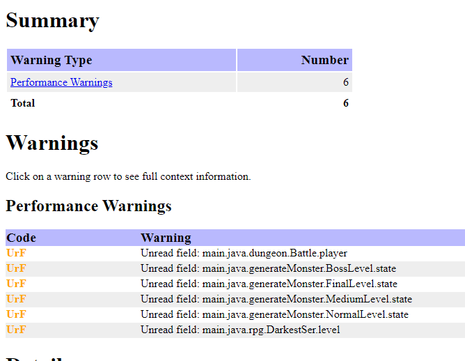
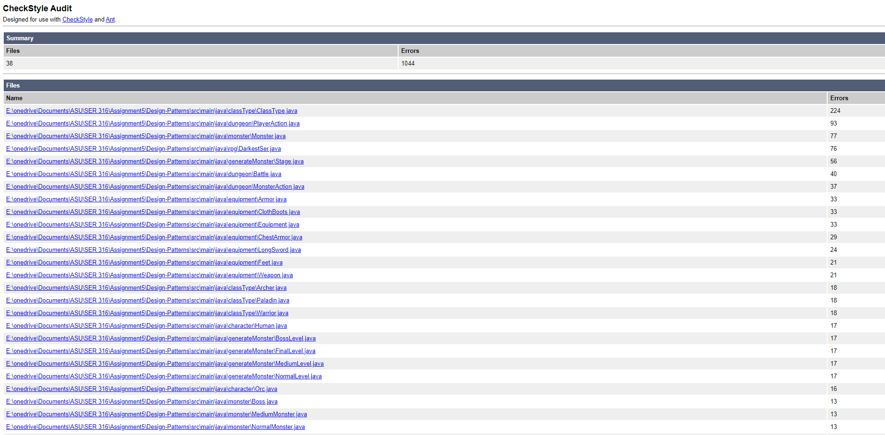
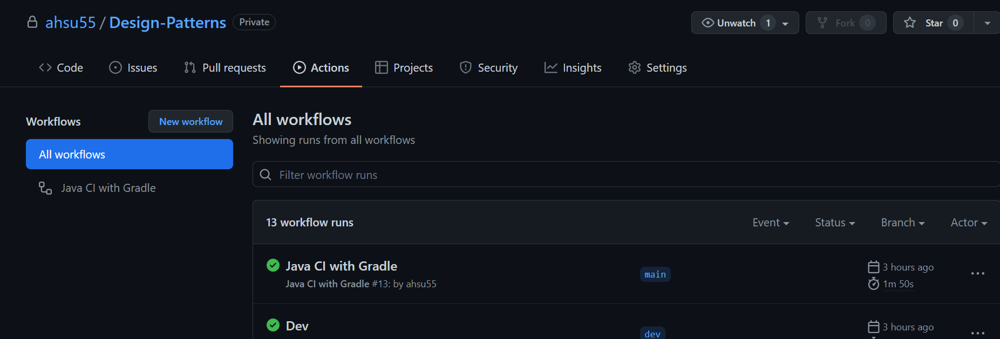
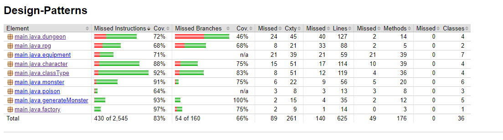
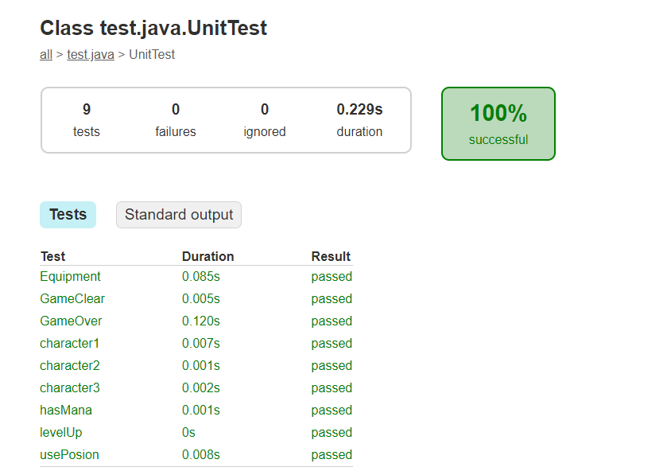

#GitHub
https://github.com/ahsu55/Design-Patterns.git
# Design-Patterns

## Singleton:Rpg.java, package dungeon
For starting the game
## Abstract Factory: package equipment, character, classType,poison, monster
Giving different states and type for the equipments, characters, monsters and poisons
## Factory: package factory
For building character class and race
## Decorator: package classType
Archer,Paladin,Warrior is a decorator of the game character, the game in the future could level up and transform to different class type when reach certain level instead of choose the class type in the beggining of the game.
## Mediator: RoundState.java
Tick-based battle system

## Spotbugs
For the six performance warnings, not able to get rid of it because it was an abstract class, the class doesn't use the field but all the subclasses does.
And there just no way to initialize the character 

## Check style
Not yet fixed everything yet

## GitHub actions

https://github.com/ahsu55/Design-Patterns/actions

## Jacoco report
Since the package dungeon is a singleton, it was difficult to cover everything there, but should achieve 70% code coverage excludes the main and the getter, setter.

## JUnit test

## Screencast
https://youtu.be/c65RV2pl6YE

Requirements:
- [x] You must be able to choose a class for your character (or have it assigned randomly), each class has a different subset of skills or magic. A class would constitute something
along the lines of ’fighter’, ’mage’, ’thief’, get creative with it!
- [x] You should be able to choose a type for your character (or have it assigned randomly),each race should have one passive skill that gets better after leveling up or that gives
them advantage over another. rate A type would constitute something like, ’orc’, ’elf’, ’dwarf’, ’human’. Perhaps orcs are stronger naturally, perhaps elves are the
most nimble and can dodge better, maybe humans have less HP but gain exp at a faster, get creative with it!
- [x] You should encounter a randomly generated ’small’ enemy every floor, a ’medium’ enemy every 5 floors, and a ’BOSS’ every 10 floors.
- [x] Your character should be able to equip items such as a sword, shield, helmet, armor, boots, etc. Your character should be able to equip a minimum of 3 unique item
types. You get to decide what happens if you come across a second item type. For example, if you have 3 different swords you have programmed, and you have one
equipped and come across another, does it automatically replace the old one? Does it compare stats and pick the better one? What happens if you don’t take it? If
you only have one sword programmed and you already have one equipped and come across a new one, what happens?
- [ ] After each battle you should have a small chance to find a chest that contains items such as armor/money/potions, or a shop where you can spend your money.
- [ ] The shop should sell 3 random objects, weapons, magic scrolls (good for one use), potions (good for one use), instant level up (RARE), get creative with it.
- [x] Potions should never give more Health or Mana than you have as a maximum.
- [x] After each floor (and after each possible random encounter with a shop) you should go back to the top floor if your health is below 15%. Going to the top floor gives
you back all of your health and mana
- [x] All enemies should get harder for each floor you travel to, for example, an enemy on floor 2 should be much, much weaker than an enemy on floor 48!
- [ ] The game should run on cycles. A cycle is considered to be 4 parts. Q1, Q2, Q3, and Q4. Each part should last around 3-5 floors have it’s own event (use your creativity, here’s a few examples to get started)
- Q1 - Physical attacks always deal X amount less damage
- Q2 - 5% chance to take a second turn in a row (applies to enemies as well 
- Q3 - gain extra money!
- [x] Your character should have at minimum: Stats: Attack, Health, Mana/Other Resource such as cooldown, Defense, and speed. Others can be added.
- [x] Should have at least 1 skill or magic power they can use
- [ ] Physical attacks should have a chance to critically strike (double damage)
- [x] All attacks should have a chance to fail/miss
- [x] Attacks should deal a min damage of 1
- [ ] You gain experience from winning battles, at certain thresholds you should be able to choose a skill or magic power to upgrade. For example:
- Lvl 1: Strike 
- Lvl 10: Double Strike 
- Lvl 15: Triple Strike
- [x] Leveling up should only happen ~~when at the top floor~~ when defeat monsters. For example, if I have 300 experience and go back to the top floor and I’m level 1
(previous experience cap = 0), if we assume the experience to level up is 10 * 2 * current level + previous experience cap.(Leveling up happens when defeat monsters)
- [x] During combat:
  - [x] Attacks and item usage should happen in a turn based fashion, the participant with the highest speed should go first.
  - [x] When a participant reaches 0 or less HP, they lose the fight, if the loser is you, you ~~lose an amount of money and~~ go back to the top floor ~~and only gain 20~~
  - [x] During either participants turn, they can either attack or use a consumable item.
  - [ ] Your simulation should include at least 3 temporary status effect and at least 1 permanent status effect that either hinders or helps your character in some way. Status
effects could include: poisoned, burned, asleep, paralyzed, strengthened, quickened, crippled, bleeding, cursed, etc.